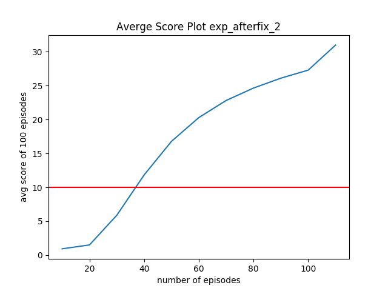

# Reacher

### Description 

This repository contains the code to train the reinforcement learning agent to learn the reacher environment. 
It uses value based method and 3 layer neural network to model the agent. The code base is written in python and pytorch. 

### State Description 

The state space has 33 dimensions which contain the information regarding the agent's current environment.  Given this information, the agent has to learn how to best select actions.  Each action is a vector with four numbers, corresponding to torque applicable to two joints.
I have used the 20 agents versions. 

### Instruction:
1. Download the environment from [this link](https://s3-us-west-1.amazonaws.com/udacity-drlnd/P2/Reacher/Reacher_Linux_NoVis.zip)
2. Fix the env path in `main.py`
3. Run 
    ```sh  
    $ python main.py
    ```
4. optionally run `create_plot.py` to create the reward plot.

### Result
- The environment solved using ddqg.
    - gamma 0.99 
    - tau 1e-3 
    - max_t=1000, 
    - lr_actor=1e-4 
    - lr_critic=3e-4
    - n_updates 10
    - update_intervals 20
    
###  Score plot: 
It is considered to be solved after 40 epochs

   
