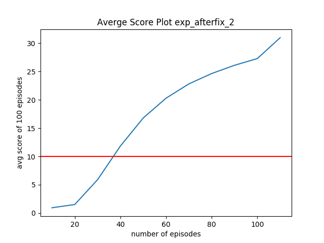

# Reacher Environment 

### Learning Algorithm
- DDPG method
- Critic is used to approximate the maximizer over the Q values of the next state. 
- It modifies DQN such that it takes the continuous actions. 
- The actor is learning the argmax of Q

- input space: 
    - 33 dimensions
    - continuous
- action space: 
    - 4 dimension, continuous


### DDPG details

DDPG is a policy gradient algorithm that uses a stochastic behavior policy for good exploration but estimates a deterministic target policy, which is much easier to learn

##### Hyper parameters 
    - gamma 0.99 
    - tau 1e-3 
    - max_t=1000, 
    - lr_actor=1e-4 
    - lr_critic=3e-4
    - n_updates 10
    - update_intervals 20
    
##### Network Architecture:
```
Critic(                                                                                                       
  (bn_input): BatchNorm1d(33, eps=1e-05, momentum=0.1, affine=True, track_running_stats=True)                 
  (fcs1): Linear(in_features=33, out_features=400, bias=True)                                                 
  (bn_fcs1): BatchNorm1d(400, eps=1e-05, momentum=0.1, affine=True, track_running_stats=True)                 
  (fc2): Linear(in_features=404, out_features=300, bias=True)                                                 
  (fc3): Linear(in_features=300, out_features=1, bias=True)                                                   
  )
  
 
```
    
##### algorithm

1. Observe states with the current policty mu theta + n
    ```python
    actions = agent.act(states)
    ```
2. Execute a in the environment and observe next state (s,a,r,s',d')
    ```python
    env_info = env.step(actions)[brain_name]  # send all actions to tne environment
    next_states = env_info.vector_observations  # get next state (for each agent)
    rewards = env_info.rewards  # get reward (for each agent)
    dones = env_info.local_done  # see if episode finished
    ```
    
3. save experiences to the replay buffer
    ```python
    agent.remember(states, actions, rewards, next_states, dones)
    ```
    
4. learn by sampling from the replay buffer, if it is time to update, for however many updates
    ```python
    agent.update(n_updates, update_intervals, t)
    ```
    1. Learn Critic 
        1. Get predicted next-state actions and Q values from target models
            ```python
            actions_next = self.actor_target(next_states)
            Q_targets_next = self.critic_target(next_states, actions_next)
            ```
        2. Compute Q targets for current states (y_i) 
            ```python
            [Q_targets = rewards + (gamma * Q_targets_next * (1 - dones))]
            ```
        3. Compute critic loss
            ```python
            Q_expected = self.critic_local(states, actions)
            critic_loss = F.mse_loss(Q_expected, Q_targets)
            ```
        4. Minimize the critic loss
            ```python
            self.critic_optimizer.zero_grad()
            critic_loss.backward()
            torch.nn.utils.clip_grad_norm_(self.critic_local.parameters(), 1)  #
            self.critic_optimizer.step()
            ```
    2. Learn Actor
        1. Compute actor loss
            ```python
            actions_pred = self.actor_local(states)
            actor_loss = -self.critic_local(states, actions_pred).mean()
            ```
        2. Minimize the loss
            ```python
            self.actor_optimizer.zero_grad()
            actor_loss.backward()
            self.actor_optimizer.step()
            ```
    3. Update target networks
        ```python
        self.soft_update(self.critic_local, self.critic_target, self.tau)
        self.soft_update(self.actor_local, self.actor_target, self.tau)
        ```
     
###  Score plot: 
It is considered to be solved after 40 epochs

   
    
### Ideas for Future Work

Instead of using random sampling from the replay buffer, we can use the priortized replay to stablize the learning. 
