# Banana Navigation

### Learning Algorithm
- DDPG method
- Critic is used to approximate the maximizer over the Q values of the next state. 
- It modifies DQN such that it takes the continuous actions. 
- The actor is learning the argmax of Q

- input space: 
    - 33 dimensions
    - continuous
- action space: 
    - 4 dimension, continuous

### Problem:
Tried training under variety of settings, yet did not see it reach above 10.  

### experiment log

#### batchsize 128 experiment 1
    - batch norm : False
    - tau : 1e-3
    - n_critic_layer : 3
    - gamma : 0.99
    - lr_actor : 1e-4
    - weight_decay 1.0

#### batchsize 128 experiment 2 ( has batchnorm)
    - batch norm : True
    - tau : 1e-3
    - n_critic_layer : 3
    - gamma : 0.99
    - lr_actor : 1e-4
    - weight_decay 1.0

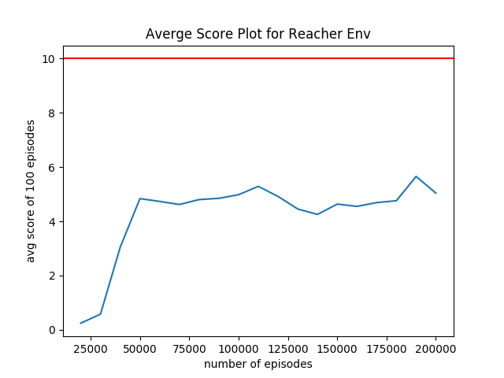

#### batchsize 128 experiment 3 (smaller tau)
    - batch norm : True
    - tau : 1e-2
    - n_critic_layer : 3
    - gamma : 0.99
    - lr_actor : 1e-4
    - weight_decay 1.0

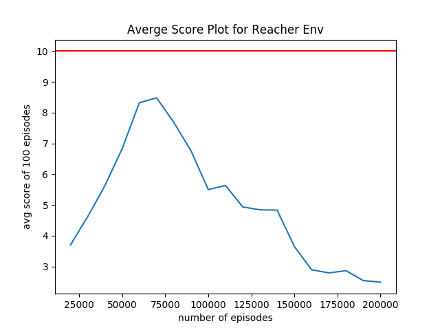

#### batchsize 128 experiment 4 (smaller tau, bigger lr for actor)
    - batch norm : True
    - tau : 1e-2
    - n_critic_layer : 3
    - gamma : 0.99
    - lr_actor : 5e-4
    - weight_decay 1.0

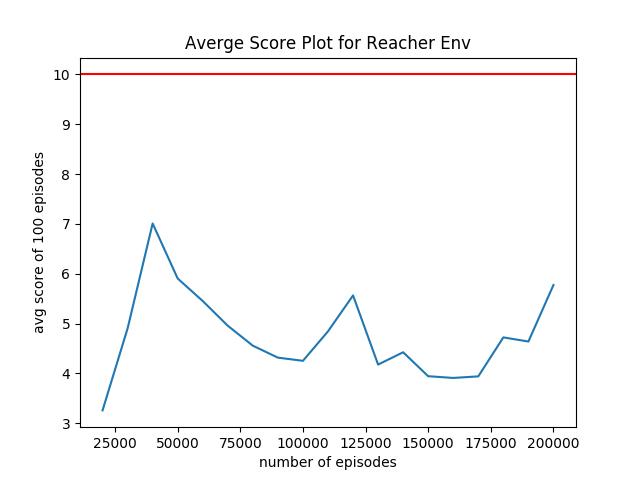

#### batchsize 128 experiment 5 (no batchnorm, smaller tau)
    - batch norm : False
    - tau : 1e-2
    - n_critic_layer : 3
    - gamma : 0.99
    - lr_actor : 1e-4
    - weight_decay 1.0

#### batchsize 128 experiment 6 (yes batchnorm, a bit smaller tau)
    - batch norm : True
    - tau : 5e-2
    - n_critic_layer : 3
    - gamma : 0.99
    - lr_actor : 1e-4
    - weight_decay 1.0

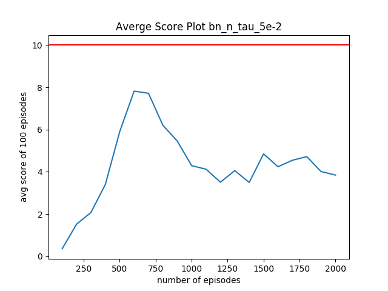

#### batchsize 128 experiment 7 (yes batchnorm, a bit smaller tau)
    - batch norm : True
    - tau : 5e-2
    - n_critic_layer : 3
    - gamma : 0.99
    - lr_actor : 1e-4
    - weight_decay 1.0

#### batchsize 256 experiment 1 (batchnorm, weightdecay 0.99)
    - batch norm : True
    - tau : 5e-2
    - n_critic_layer : 4
    - gamma : 0.99
    - lr_actor : 1e-4
    - weight_decay 0.99

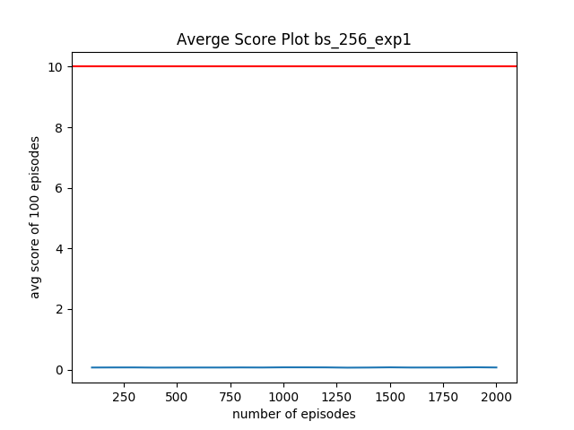

#### batchsize 256 experiment 2 (batchnorm)
    - batch norm : True
    - tau : 5e-2
    - n_critic_layer : 4
    - gamma : 0.99
    - lr_actor : 1e-4
    - weight_decay 1.0

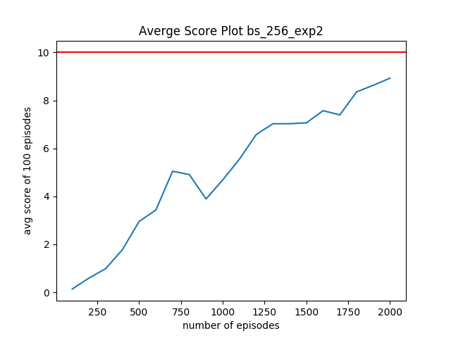

#### batchsize 256 experiment 3 (batchnorm, n critic layer 3)
    - batch norm : True
    - tau : 5e-2
    - n_critic_layer : 3
    - gamma : 0.99
    - lr_actor : 1e-4
    - weight_decay 1.0

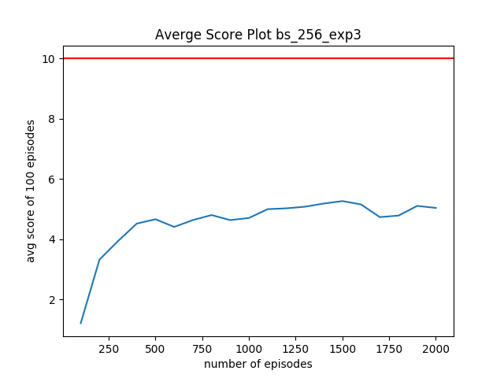

#### batchsize 256 experiment 4 (batchnorm, n critic layer 3, weight decay)
    - batch norm : True
    - tau : 5e-2
    - n_critic_layer : 3
    - gamma : 0.99
    - lr_actor : 1e-4
    - weight_decay 0.99

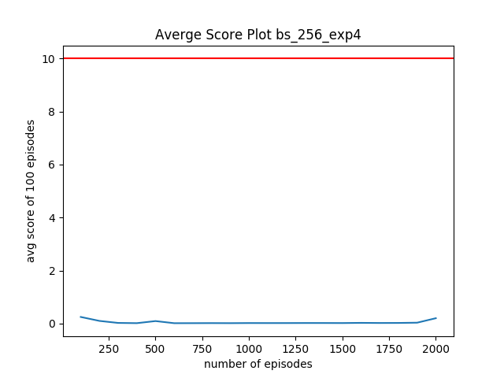

#### batchsize 256 experiment 5 (batchnorm, smaller tau, n critic layer 4)
    - batch norm : True
    - tau : 1e-2
    - n_critic_layer : 4
    - gamma : 0.99
    - lr_actor : 1e-4
    - weight_decay 1.0

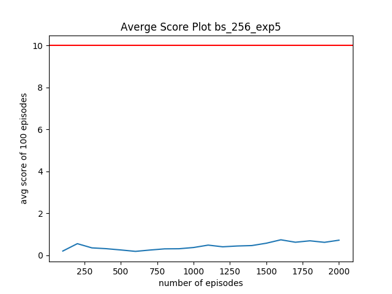

#### batchsize 256 experiment 6 (batchnorm, smaller tau, n critic layer 5)
    - batch norm : True
    - tau : 1e-2
    - n_critic_layer : 5
    - gamma : 0.99
    - lr_actor : 1e-4
    - weight_decay 1.0

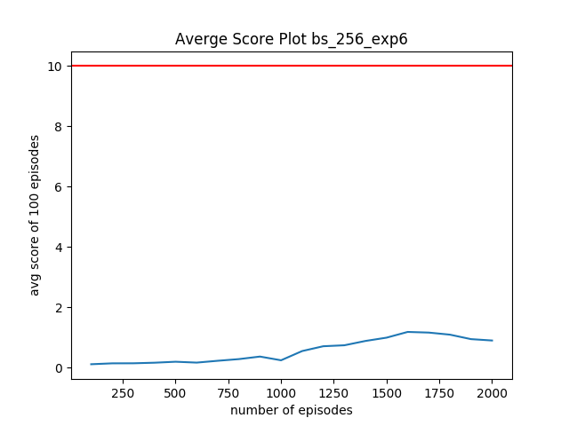

#### batchsize 256 experiment 7 (batchnorm, n critic layer 4, lr actor 1e-3)
    - batch norm : True
    - tau : 5e-2
    - n_critic_layer : 4
    - gamma : 0.99
    - lr_actor : 1e-3
    - weight_decay 1.0

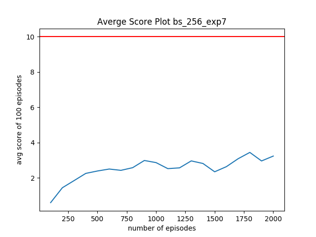

#### batchsize 256 experiment 7 (batchnorm, n critic layer 5, lr actor 1e-4 lr_critic 1-e4)
    - batch norm : True
    - tau : 5e-2
    - n_critic_layer : 5
    - gamma : 0.99
    - lr_actor : 1e-4
    - lr_critic : 1e-4
    - weight_decay 1.0

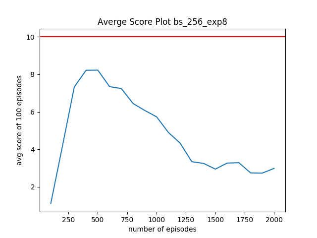

### Ideas for Future Work
Might need to change the algorithm. Should I run more episodes?